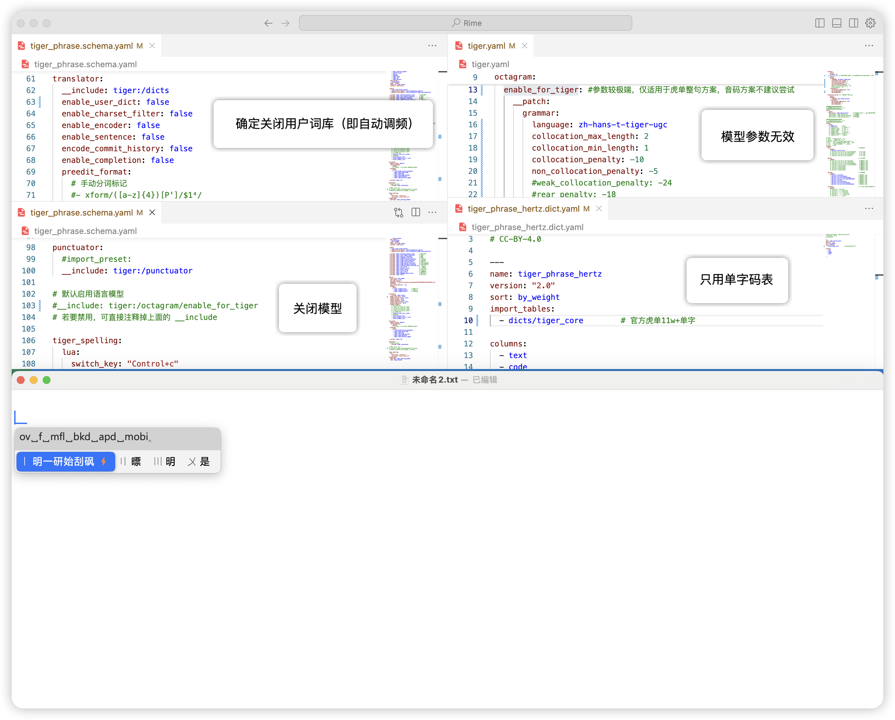
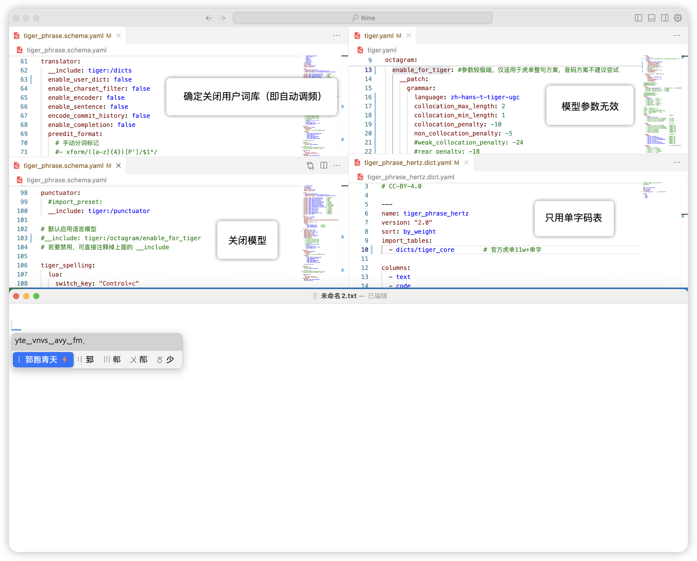
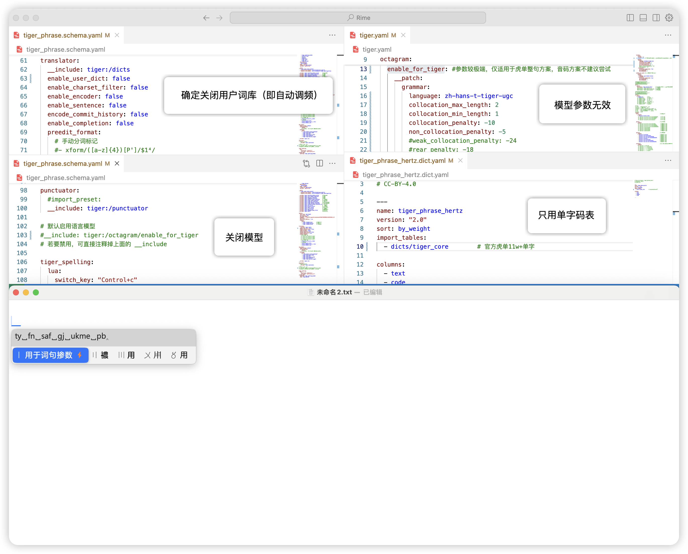
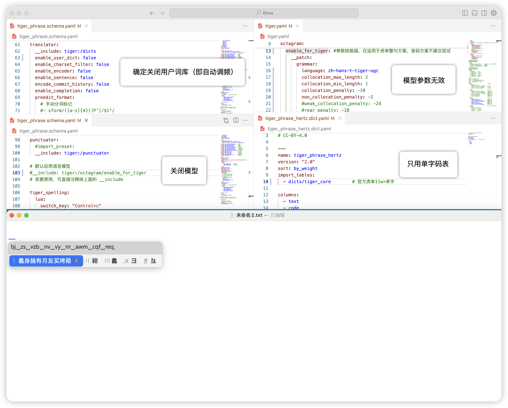
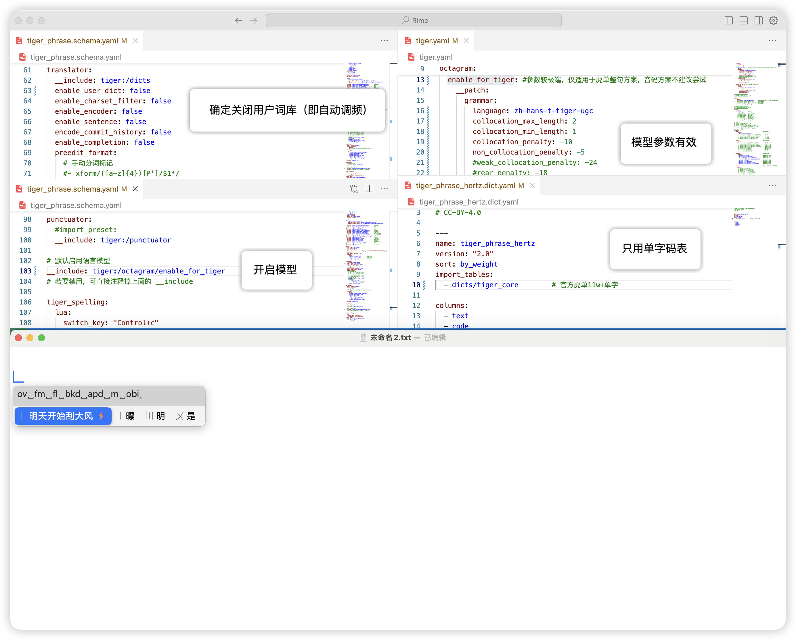
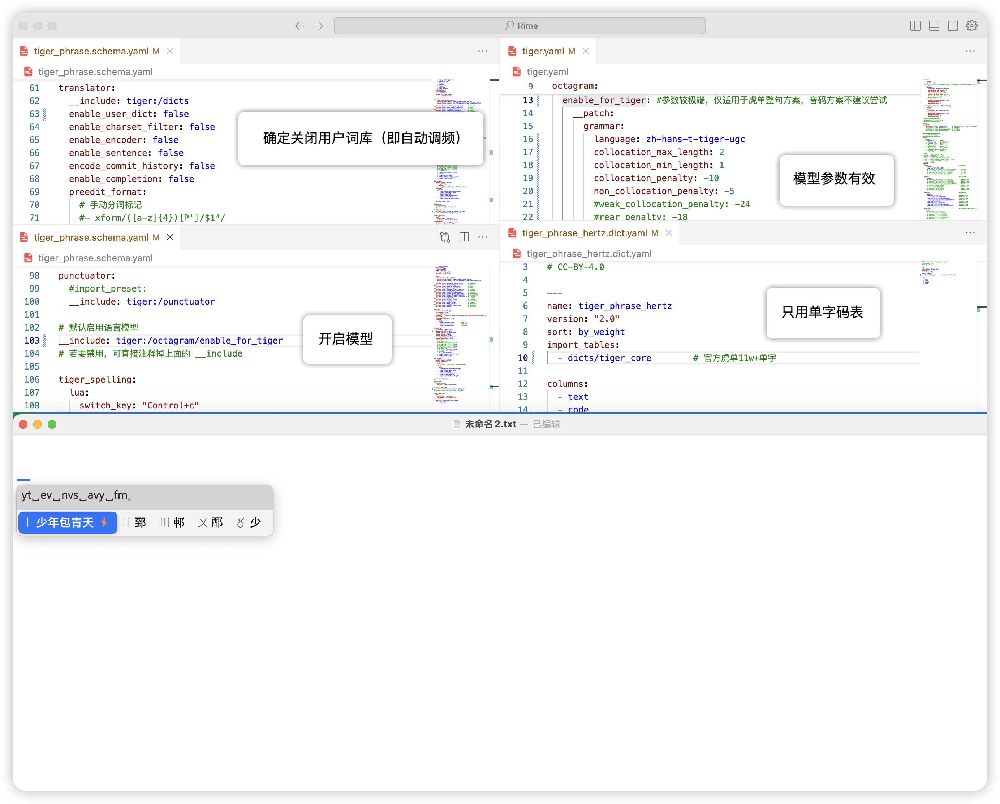
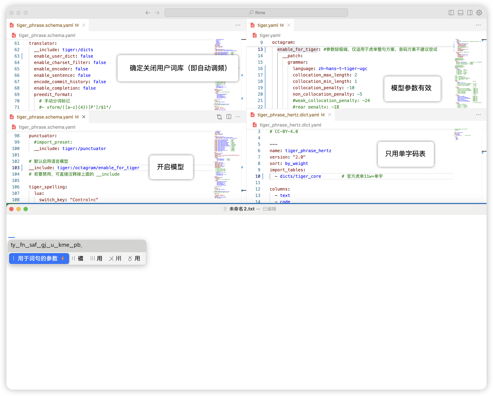
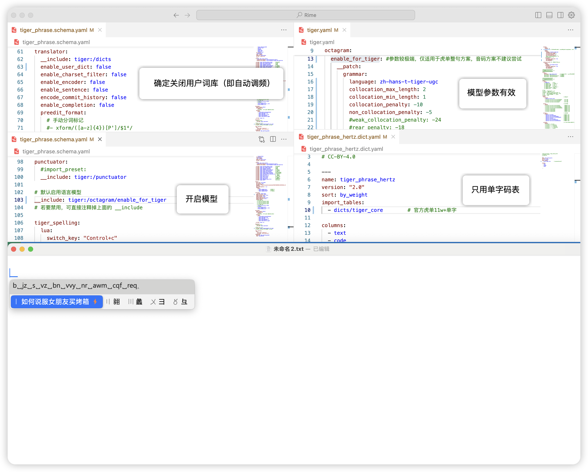

## Example

```yaml
__include: /octagram/enable_for_tiger
octagram:
  disable: # 禁用octagram
    __patch:
      grammar: {}
  enable_for_tiger: # 参数较极端，仅适用于虎单整句方案，音码方案不建议尝试
    __patch:
      grammar:
        language: zh-hans-t-tiger-ugc
        collocation_max_length: 2
        collocation_min_length: 1
        collocation_penalty: -10
        non_collocation_penalty: -5
        #weak_collocation_penalty: -24
        #rear_penalty: -18
      translator/+:
        contextual_suggestions: true
        max_homophones: 1
        max_homographs: 1

```

## 效果参考

### 关闭语言模型





### 开启语言模型





